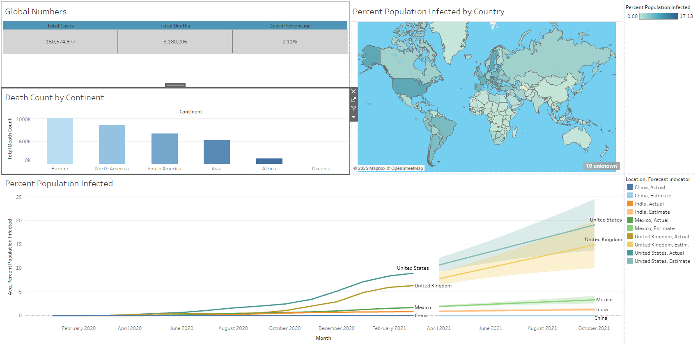

# COVID-Data-Project
This is a project where I employed SQL to discover trends within the large COVID dataset, and then presented my findings in Tableau with a comprehensive dashboard.

## 📊 Tableau Dashboard: [COVID Dashboard]

Check out my interactive dashboard on Tableau Public:  

👉 [View Dashboard on Tableau Public](https://public.tableau.com/app/profile/nicholas.stone/viz/COVIDDashboard_17428376484760/COVIDDashboard)

)
